  
  
  
  

---

# 🎓 Awesome Alumni Management Systems & Higher-Ed CRM Ecosystem

A comprehensive, curated list of **commercial SaaS platforms** and **open-source GitHub projects** for **Alumni Management**, constituent relationship management (CRM), higher-education advancement, donor engagement, mentorship networks, and university alumni portals.

**Last updated:** September 2026

---

## 📌 Table of Contents
- [🌐 Sector Overview & Market Size](#-sector-overview--market-size)
- [💼 Commercial SaaS Platforms](#-commercial-saas-platforms)
- [🔓 Open-Source GitHub Projects](#-open-source-github-projects)
- [🎯 Key Feature Comparison](#-key-feature-comparison)
- [🤝 How to Contribute](#-how-to-contribute)
- [📜 Disclaimer](#-disclaimer)
- [💖 Support & Sponsorship](#-support--sponsorship)
- [📈 Star History](#-star-history)

---

## 🌐 Sector Overview & Market Size

> [!NOTE]
> **Market Size & Market Structure**: The global Higher Education & Alumni Management Software market size is estimated at **$2.8 Billion – $4.2 Billion**, expanding at a CAGR of ~10.5%. The sector is **moderately fragmented**: enterprise fundraising and constituent management are dominated by incumbent giants like Blackbaud, while a dynamic array of vertical SaaS solutions (Hivebrite, EverTrue, Graduway) compete for digital alumni engagement, career mentorship, and annual giving workloads.

---

## 💼 Commercial SaaS Platforms

Below is a curated summary of top commercial alumni management and advancement CRM platforms, ordered by **Company Size (Revenue / Valuation)** in descending order:

| 🏢 Platform | 💰 Pricing (Starting Tier) | 🎁 Free Tier / Trial Limit | 📊 Company Size (Revenue / Valuation) | 🎯 Primary Focus & Features |
| :--- | :--- | :--- | :--- | :--- |
| **[Blackbaud Raiser’s Edge NXT](https://www.blackbaud.com/)** | ~$4,000 / year (custom quote) | No free plan; 30-day trial for select add-on modules | **~$1.15 Billion** Revenue / **~$3.8 Billion** Market Cap | Enterprise higher-ed advancement, constituent tracking, gift processing & donor intelligence. |
| **[EverTrue](https://www.evertrue.com/)** | ~$10,000 / year (custom quote) | No free plan; 14-day interactive demo on request | **~$33.0 Million** Revenue / **~$100.0 Million** Valuation | Predictive donor analytics, mobile gift officer engagement & social donor management. |
| **[Graduway (Gravyty)](https://www.graduway.com/)** | ~$5,000 / year (custom quote) | No free plan; scheduled institutional sales demo | **~$25.0 Million** Revenue / **~$80.0 Million** Valuation | Official alumni directories, career mentorship networks, digital reunions & video outreach. |
| **[Hivebrite](https://hivebrite.com/)** | $895 / month (billed annually) | No free plan; 14-day guided sandbox demo | **~$21.9 Million** Revenue / **~$109.7 Million** Valuation | Complete community platform with member directories, event ticketing, job boards & groups. |
| **[PeopleGrove](https://www.peoplegrove.com/)** | ~$12,000 / year (custom quote) | No free plan; guided demo environment on request | **~$17.0 Million** Revenue / **~$60.0 Million** Valuation | Alumni-student mentorship matching, career pathways, networking & experiential learning. |
| **[Almabase](https://www.almabase.com/)** | ~$7,000 / year (custom quote) | No free plan; 14-day sandbox demo on request | **~$13.8 Million** Revenue / **~$45.0 Million** Valuation | Automated alumni database sync, digital event registration & online donation pages. |
| **[Vaave](https://www.vaave.com/)** | ~$1,500 / year (custom quote) | No free plan; 14-day admin trial on request | **~$9.9 Million** Revenue / **~$30.0 Million** Valuation | End-to-end alumni portal, mobile apps, event management & job opportunity sharing. |
| **[ToucanTech](https://www.toucantech.com/)** | £8,000 / year (~$10,000 / year) | No free plan; 30-day interactive sandbox demo | **~$7.3 Million** Revenue / **~$25.0 Million** Valuation | All-in-one website builder, alumni CRM, news publishing & email marketing suite. |
| **[Anthology Engage](https://www.anthology.com/)** | ~$6,000 / year (custom quote) | No free plan; institutional sandbox demo | **~$6.5 Million** Segment Rev / **~$20.0 Million** Segment Val | Campus lifecycle engagement, student-to-alumni transitions & event management. |

---

## 🔓 Open-Source GitHub Projects

These open-source repositories provide self-hosted alternatives, extensible frameworks, or core components for building custom alumni portals, constituent relationship management systems, and community hubs. Sorted by **Star Count** (descending):

| 📦 Repository & Star Badge | 🛠️ Stack & License | 📝 Description & Alumni Use Case |
| :--- | :--- | :--- |
| **[Twenty](https://github.com/twentyhq/twenty)**  | TypeScript / AGPL-3.0 | Modern open-source CRM platform alternative to Salesforce; highly customizable for tracking alumni contacts and pipeline management. |
| **[Odoo](https://github.com/odoo/odoo)**  | Python / LGPL-3.0 | Comprehensive open suite featuring modular Education, Alumni Directory, Member Management, and CRM applications. |
| **[Discourse](https://github.com/discourse/discourse)**  | Ruby on Rails / GPL-2.0 | Next-generation community forum and discussion platform widely used for alumni chapters, topic boards, and peer Q&A. |
| **[ERPNext](https://github.com/frappe/erpnext)**  | Python & JS / GPL-3.0 | Full-featured ERP system with dedicated Education and Alumni Portal modules for institutions managing student-to-alumni workflows. |
| **[SuiteCRM](https://github.com/salesagility/SuiteCRM)**  | PHP / AGPL-3.0 | Enterprise-grade open CRM adapted for higher-ed advancement, constituent relations, campaign tracking, and donor histories. |
| **[EspoCRM](https://github.com/espocrm/espocrm)**  | PHP & JS / GPL-3.0 | Lightweight, flexible open-source CRM application for storing alumni contact cards, communication logs, and chapter events. |
| **[CiviCRM Core](https://github.com/civicrm/civicrm-core)**  | PHP / AGPL-3.0 | The premier open constituent relationship management system for non-profits and universities; tracks alumni giving, memberships, and events. |
| **[Mentorship Backend](https://github.com/anitab-org/mentorship-backend)**  | Python / MIT | Open 1-on-1 mentor matching platform engine designed for connecting students with experienced alumni mentors. |
| **[AlumNet](https://github.com/jungang/alumnet)**  | Vue & Python / MIT | AI-powered intelligent school history exhibition and alumni profile graph management system. |
| **[Alumni Connect](https://github.com/PIXIL2-0/Alumni-Connect)**  | React & Node.js / MIT | Web application for college alumni networking, searchable directory (by year/company), referral requests, and secure messaging. |

---

## 🎯 Key Feature Comparison

When selecting an alumni management solution for your university, school, or association, consider the following primary evaluation pillars:

1. **CRM Synchronization**: Compatibility with enterprise databases (Salesforce, Blackbaud, CiviCRM, or SQL databases).
2. **Mentorship & Career Hub**: Automated mentor matching algorithms, job posting boards, and flash networking tools.
3. **Fundraising & Annual Giving**: Integrated digital donation forms, campaign tracking, and gift officer analytics.
4. **Data Privacy & Compliance**: Adherence to FERPA, GDPR, CCPA, and regional student/alumni data privacy regulations.

---

## 🤝 How to Contribute

Contributions are warmly welcome! To add a new commercial SaaS platform or open-source GitHub project:

1. Fork the repository.
2. Edit `README.md` following the existing tabular structure.
3. Include factual data (pricing starting tiers, exact free trial/tier limits, company size or GitHub star counts).
4. Submit a Pull Request with a short explanation.

Check out our main curated ecosystem at **[Awesome-Awesome-Awesome](https://github.com/ishandutta2007/Awesome-Awesome-Awesome)**.

---

## 📜 Disclaimer

- This list is community-curated for informational and educational purposes only.
- Alumni management tools process sensitive personal and educational records; ensure institutional compliance before deployment.

---

## 💖 Support & Sponsorship

Thank you for checking out **Awesome-Alumni-Management**! If this list has helped your team, institution, or project, please consider supporting the project:

- 🌟 **Star this repository** to help others find it!
- 🔀 **Fork & Share** it with higher-ed professionals and developers.
- ☕ **Sponsor / Buy me a coffee**: Support ongoing open-source maintenance via [GitHub Sponsors](https://github.com/sponsors/ishandutta2007).

---

## 📈 Star History

